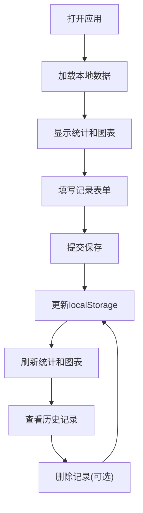

## 1. 产品概述

个人碳足迹追踪工具是一款纯前端浏览器应用，帮助用户记录和分析日常生活中的碳排放行为，提升环保意识。
- 核心功能：记录碳排放活动、可视化数据展示、与全国人均水平对比
- 目标用户：关注环保、希望了解自身碳足迹的普通大众

## 2. 核心功能

### 2.1 功能模块
1. **记录表单**：碳排放活动录入（类别、行为、排放量、日期）
2. **数据图表**：最近30天每日碳排放量堆叠柱状图
3. **统计面板**：本月总排放、日均排放、与全国人均对比
4. **历史记录**：查看和管理所有碳排放记录

### 2.2 页面详情
| 页面名称 | 模块名称 | 功能描述 |
|-----------|-------------|---------------------|
| 首页 | 记录表单 | 选择类别、输入具体行为、填写碳排放量、选择日期 |
| 首页 | 统计面板 | 显示本月总排放量、日均排放量、与全国人均数据对比 |
| 首页 | 图表展示 | Canvas绘制最近30天的堆叠柱状图，不同类别用不同颜色 |
| 首页 | 历史列表 | 展示所有记录，支持删除操作 |

## 3. 核心流程

用户打开页面 → 填写碳排放记录表单 → 提交保存到localStorage → 系统自动更新统计数据和图表 → 用户可查看历史记录和趋势分析

## 4. 用户界面设计

### 4.1 设计风格
- **主色调**：环保绿色系（#2E7D32），象征自然与可持续发展
- **辅助色**：各分类使用鲜明区分色：交通蓝、饮食橙、能源黄、购物紫、其他灰
- **按钮风格**：圆角矩形，渐变绿色，悬停有轻微上浮效果
- **字体**：标题用Playfair Display，正文用Lato
- **布局风格**：卡片式布局，左右分栏，左为表单和统计，右为图表和历史
- **图标风格**：使用emoji图标，简洁直观

### 4.2 页面设计概述
| 页面名称 | 模块名称 | UI Elements |
|-----------|-------------|-------------|
| 首页 | 记录表单 | 下拉选择器、文本输入框、数字输入框、日期选择器、提交按钮 |
| 首页 | 统计面板 | 大数字展示、进度条对比、数据卡片 |
| 首页 | 图表展示 | Canvas画布、图例说明、渐变背景 |
| 首页 | 历史列表 | 记录卡片、删除按钮、滚动区域 |

### 4.3 响应性
- Desktop-first设计，桌面端左右两栏布局
- 平板端改为上下布局
- 移动端单列布局，优化触控区域
- 图表自适应容器宽度

### 4.4 动画效果
- 页面加载时卡片渐入动画
- 表单提交成功提示动画
- 图表数据更新平滑过渡
- 悬停状态有轻微阴影和位移效果
