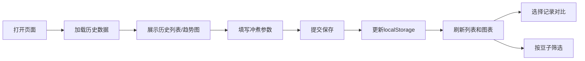

## 1. 产品概述
手冲咖啡冲煮记录工具，为咖啡爱好者提供数字化的参数记录与分析平台。替代传统纸质记录，实现冲煮数据的持久化存储、可视化分析与参数对比，帮助用户迭代冲煮技术。

- 核心价值：将冲煮经验数字化，通过数据驱动提升咖啡萃取品质
- 目标用户：有一定手冲经验、追求萃取一致性的咖啡爱好者

## 2. 核心功能

### 2.1 功能模块
1. **冲煮记录模块**：表单录入每次冲煮的完整参数
2. **历史记录模块**：列表展示所有记录，支持按豆子名称筛选
3. **趋势图表模块**：Canvas 折线图展示最近20次风味评分变化
4. **参数对比模块**：选择两条记录并排对比，高亮显示参数差异

### 2.2 页面详情
| 页面名称 | 模块名称 | 功能描述 |
|-----------|-------------|---------------------|
| 主页面 | 记录表单 | 录入豆子名称、研磨度、粉量、水温、注水量、萃取时长、风味评分 |
| 主页面 | 评分趋势图 | Canvas 绘制最近20次评分折线图，展示风味变化趋势 |
| 主页面 | 历史记录列表 | 卡片式展示所有冲煮记录，支持删除操作 |
| 主页面 | 筛选功能 | 按豆子名称筛选历史记录，支持模糊匹配 |
| 主页面 | 参数对比面板 | 从历史中选择两条记录并排展示，差异参数用颜色高亮标记 |

## 3. 核心流程
用户打开 `index.html` → 填写冲煮参数表单 → 提交保存到 localStorage → 页面自动刷新历史列表和趋势图 → 可选择两条记录进行参数对比 → 可按豆子名称筛选历史记录

## 4. 界面设计

### 4.1 设计风格
- **主色调**：深咖啡棕 `#3E2723`，搭配温暖奶油色 `#FFF8E1`，营造精品咖啡馆的氛围
- **强调色**：琥珀色 `#FF8F00`，用于评分高亮和对比差异标记
- **中性色**：暖灰色系，确保阅读舒适度
- **字体**：标题使用衬线字体 Playfair Display（优雅精品感），正文使用 Lato（清晰易读）
- **布局**：卡片式布局，微妙的圆角和阴影，层次感分明
- **按钮风格**：圆角矩形，悬停有轻微上浮和阴影加深效果
- **整体调性**：温暖、精致、专业，贴合精品咖啡文化

### 4.2 页面设计概览
| 页面名称 | 模块名称 | UI 元素 |
|-----------|-------------|-------------|
| 主页面 | 记录表单 | 标签 + 数字输入框 + 滑块（研磨度/评分）+ 提交按钮 |
| 主页面 | 趋势图 | Canvas 画布，带坐标轴、数据点、渐变填充折线 |
| 主页面 | 历史列表 | 卡片网格，每条记录显示豆子名、评分、日期，悬停动效 |
| 主页面 | 对比面板 | 两列并排布局，差异项背景色高亮 |
| 主页面 | 筛选栏 | 输入框实时过滤，下拉自动补全豆子名称 |

### 4.3 响应式设计
- 桌面端优先，采用 Grid 布局，左侧表单+图表，右侧历史列表
- 移动端自适应为单列布局，历史列表在下方
- 触控区域优化，按钮最小 44x44px

### 4.4 交互动效
- 页面加载时元素渐入，表单→图表→列表依次出现
- 表单提交成功有微妙的成功反馈动画
- 卡片悬停轻微上浮，阴影加深
- 对比面板切换时平滑过渡
