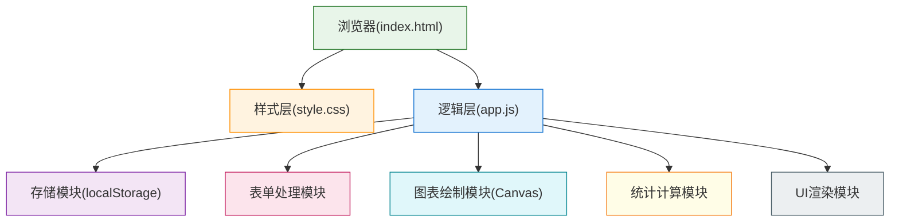
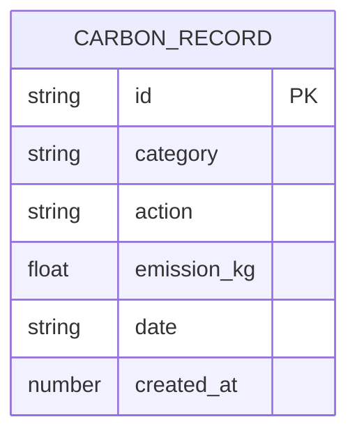

## 1. 架构设计



## 2. 技术描述

- **前端技术**：纯原生 HTML5 + CSS3 + JavaScript (ES6+)
- **数据存储**：浏览器 localStorage
- **图表绘制**：原生 Canvas 2D API
- **依赖库**：无（零依赖）
- **运行方式**：直接打开 index.html 即可使用

## 3. 文件结构

| 文件 | 用途 | 主要职责 |
|------|------|----------|
| index.html | 页面结构 | DOM结构、表单元素、Canvas容器、统计面板 |
| style.css | 样式设计 | 视觉样式、响应式布局、动画效果 |
| app.js | 业务逻辑 | 数据管理、表单处理、图表绘制、统计计算 |

## 4. 数据模型

### 4.1 数据模型定义



### 4.2 数据字段说明

| 字段 | 类型 | 说明 | 示例值 |
|------|------|------|--------|
| id | string | 唯一标识 | "1717123456789" |
| category | string | 排放类别 | "交通"/"饮食"/"能源"/"购物"/"其他" |
| action | string | 具体行为描述 | "开车上班20km" |
| emission_kg | float | 碳排放量(kg CO₂) | 5.2 |
| date | string | 日期(YYYY-MM-DD) | "2024-05-31" |
| created_at | number | 创建时间戳 | 1717123456789 |

### 4.3 固定参考数据

- 中国全国人均日排放量：**19.2 kg CO₂**

## 5. 核心模块设计

### 5.1 StorageManager - 存储管理

```javascript
// 主要方法
- getRecords()       // 获取所有记录
- saveRecord(record) // 保存新记录
- deleteRecord(id)   // 删除指定记录
```

### 5.2 FormHandler - 表单处理

```javascript
// 主要方法
- init()            // 初始化表单绑定
- validate(data)    // 表单验证
- handleSubmit()    // 提交处理
- resetForm()       // 重置表单
```

### 5.3 ChartRenderer - 图表绘制

```javascript
// 主要方法
- render()          // 渲染图表
- drawStackedBars() // 绘制堆叠柱状图
- drawLegend()      // 绘制图例
- drawAxes()        // 绘制坐标轴
```

### 5.4 Statistics - 统计计算

```javascript
// 主要方法
- getMonthlyTotal()  // 本月总排放
- getDailyAverage()  // 日均排放
- compareWithNational() // 与全国人均对比
- get30DaysData()    // 最近30天数据
```

### 5.5 类别颜色配置

| 类别 | 颜色 |
|------|------|
| 交通 | #1976D2 (蓝) |
| 饮食 | #F57C00 (橙) |
| 能源 | #FBC02D (黄) |
| 购物 | #7B1FA2 (紫) |
| 其他 | #607D8B (灰) |

## 6. 性能与兼容性

- **浏览器兼容**：支持所有现代浏览器（Chrome、Firefox、Safari、Edge）
- **数据上限**：localStorage约5MB，可存储数千条记录
- **响应时间**：图表绘制 < 100ms，数据操作 < 10ms
- **离线支持**：完全离线可用，无需网络连接
