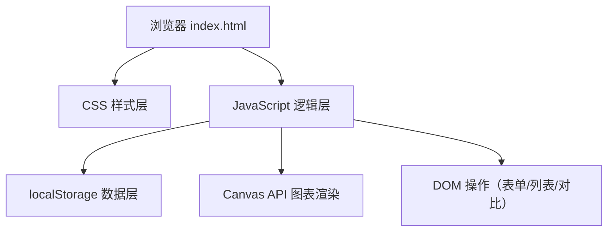

## 1. 架构设计

纯前端单页应用，无后端服务，数据持久化依赖浏览器 localStorage。



## 2. 技术描述

- **前端**：纯原生 HTML5 + CSS3 + Vanilla JavaScript (ES6+)，无任何第三方库
- **数据存储**：浏览器 localStorage，JSON 序列化存储
- **图表渲染**：原生 Canvas 2D API
- **运行方式**：直接打开 `index.html` 即可使用，无需构建工具或服务器

## 3. 文件结构

| 文件 | 用途 |
|-------|---------|
| `index.html` | 主页面结构，包含所有 DOM 元素 |
| `style.css` | 样式定义，包含主题变量、布局、组件样式、动画 |
| `app.js` | 核心业务逻辑，分模块组织 |

## 4. 数据模型

### 4.1 数据结构定义

单条冲煮记录实体：

```javascript
{
  id: String,           // 唯一标识，时间戳生成
  beanName: String,     // 豆子名称
  grindSize: Number,    // 研磨度 1-10
  coffeeWeight: Number, // 粉量（克）
  waterTemp: Number,    // 水温（摄氏度）
  waterAmount: Number,  // 总注水量（毫升）
  brewTime: Number,     // 萃取时长（秒）
  rating: Number,       // 风味评分 1-5
  createdAt: Number     // 创建时间戳
}
```

### 4.2 localStorage 键定义

- `coffeeBrewRecords`：存储所有冲煮记录的 JSON 数组
- `coffeeBeanNames`：存储历史豆子名称数组，用于筛选下拉补全

### 4.3 数据操作接口

```javascript
// 存储层
StorageManager = {
  getRecords()       // 获取所有记录
  saveRecord(record) // 保存新记录
  deleteRecord(id)   // 删除指定记录
  getBeanNames()     // 获取所有豆子名称
}

// 业务逻辑层
BrewApp = {
  init()                    // 应用初始化
  handleFormSubmit()        // 处理表单提交
  renderHistoryList()       // 渲染历史列表
  renderChart()             // 渲染评分趋势图
  filterByBeanName(keyword) // 按豆子名称筛选
  compareRecords(id1, id2)  // 参数对比
}
```

## 5. 核心模块划分

### 5.1 表单模块
- 表单验证（必填项、数值范围校验）
- 滑块与数字输入双向绑定（研磨度、评分）
- 提交成功后清空表单并刷新列表

### 5.2 历史列表模块
- 按时间倒序展示记录卡片
- 卡片展示核心参数预览
- 删除操作（带确认提示）
- 选择记录用于对比

### 5.3 筛选模块
- 输入框实时过滤（input 事件监听）
- 模糊匹配豆子名称
- 下拉自动补全历史豆子名

### 5.4 图表模块（Canvas）
- 获取最近 20 条记录的评分数据
- 绘制坐标轴、刻度、网格线
- 绘制折线（带数据点标记）
- 渐变填充区域
- 响应式 resize 重绘

### 5.5 对比模块
- 复选框选择两条记录（最多选 2 条）
- 并排展示两列参数
- 逐字段对比，差异项背景色高亮
- 差异计数统计
